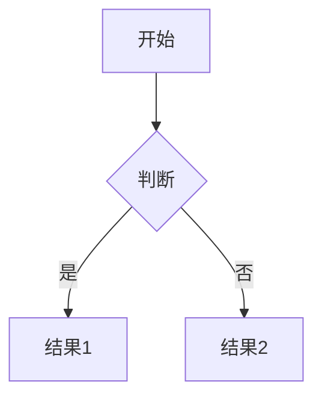
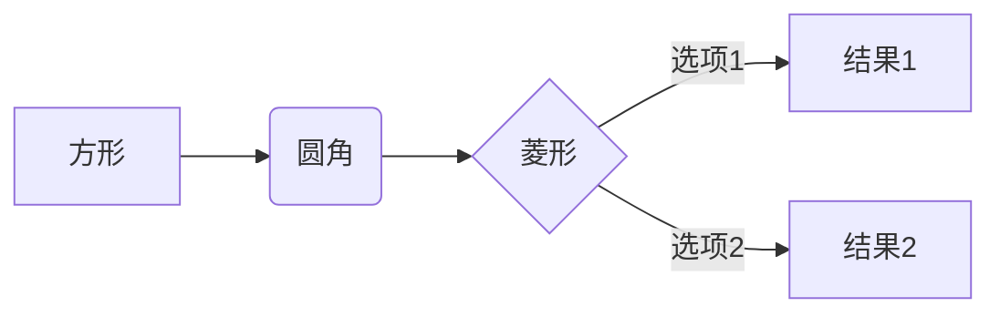
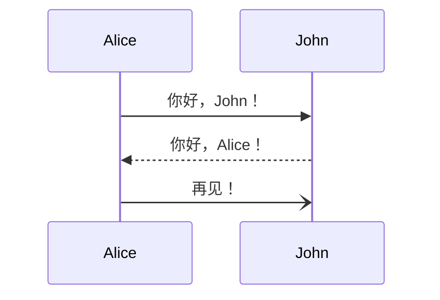
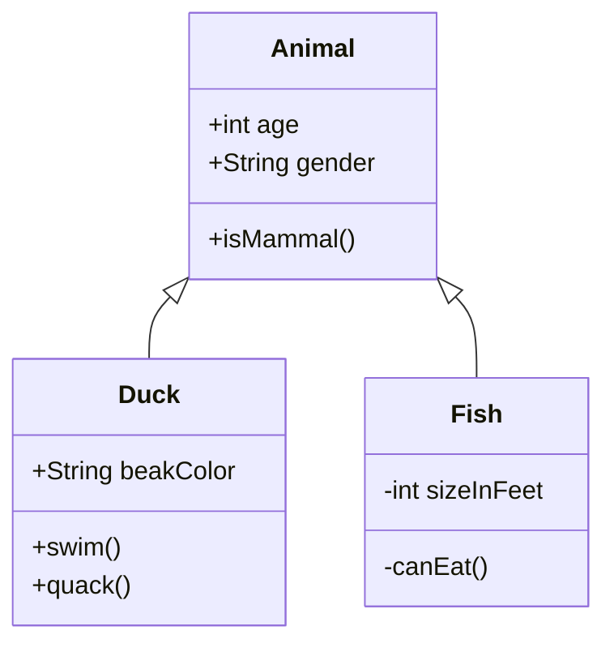

<div align="center">

<picture>
  <source media="(prefers-color-scheme: dark)" srcset="./logo-dark.svg">
  <source media="(prefers-color-scheme: light)" srcset="./logo.svg">
  
</picture>

<h3>专业的 Markdown + Mermaid 编辑器</h3>
<p>现代化 · 开箱即用 · 功能强大</p>

<br>
[](LICENSE)
[](CONTRIBUTING.md)


<br>

**[🚀 在线演示](https://your-demo-url.com)** · 
**[📝 快速开始](#快速开始)** · 
**[📖 文档](#使用指南)** · 
**[🐛 报告问题](https://github.com/yourusername/markx/issues)**

</div>

---

<div align="center">

</div>

---

## 💫 为什么选择 MarkX？

<table>
<tr>
<td align="center" width="33%">
<br>
<b>🎯 开箱即用</b><br>
无需配置，打开即用<br>
纯前端应用，秒开即写
</td>
<td align="center" width="33%">
<br>
<b>⚡ 极速渲染</b><br>
实时预览，所见即所得<br>
防抖优化，流畅体验
</td>
<td align="center" width="33%">
<br>
<b>🎨 现代设计</b><br>
亮暗主题，护眼模式<br>
响应式布局，多设备支持
</td>
</tr>
<tr>
<td align="center">
<b>📊 Mermaid 完美支持</b><br>
5种图表类型<br>
自动导出 SVG/PNG
</td>
<td align="center">
<b>🔒 安全可靠</b><br>
数据本地存储<br>
XSS 防护完善
</td>
<td align="center">
<b>🆓 完全免费</b><br>
MIT 开源协议<br>
无限制使用
</td>
</tr>
</table>

---

## ✨ 核心特性

### 🎨 完整的 Markdown 支持
- ✅ **GitHub Flavored Markdown (GFM)** - 完整支持 GFM 语法
- ✅ **实时预览** - 输入即预览，防抖优化
- ✅ **代码高亮** - 使用 Highlight.js 支持 190+ 种语言
- ✅ **表格、任务列表、删除线** - 完整的 GFM 扩展语法

### 📊 Mermaid 图表集成
- ✅ **流程图** (Flowchart) - 支持 TB/LR/RL/BT 方向
- ✅ **时序图** (Sequence Diagram) - 完美呈现交互流程
- ✅ **甘特图** (Gantt Chart) - 项目管理利器
- ✅ **类图** (Class Diagram) - UML 类关系可视化
- ✅ **状态图** (State Diagram) - 状态机表达
- ✅ **主题自适应** - 自动跟随编辑器主题
- ✅ **错误处理** - 语法错误友好提示

### 🎯 专业编辑体验
- ✅ **智能工具栏** - 常用格式一键插入
- ✅ **Mermaid 模板** - 5 种图表模板快速插入
- ✅ **快捷键支持** - Ctrl+S 保存、Ctrl+B 加粗等
- ✅ **自动草稿** - 每 30 秒自动保存到本地
- ✅ **字数统计** - 实时显示字符、词数、行数、阅读时间

### 🌓 主题与布局
- ✅ **亮色/暗色主题** - 护眼模式，跟随系统
- ✅ **4 种布局模式** - 分屏/仅编辑/仅预览/上下分屏
- ✅ **响应式设计** - 完美适配桌面、平板、手机
- ✅ **侧边目录** - 根据标题自动生成，点击跳转

### 📁 文件操作
- ✅ **新建/打开/保存** - 完整的文件操作
- ✅ **导入 .md 文件** - 支持拖拽打开
- ✅ **导出 Markdown** - 保存为 .md 文件
- ✅ **导出 HTML** - 包含样式的独立 HTML 文件
- ✅ **复制功能** - 一键复制 Markdown/HTML

### 🔒 安全性
- ✅ **XSS 防护** - 使用 DOMPurify 严格清理
- ✅ **纯前端** - 无后端依赖，数据不上传
- ✅ **本地存储** - 草稿仅保存在本地浏览器

---

## 🚀 快速开始

### 方法一：直接使用（推荐）

1. **克隆仓库**
```bash
git clone https://github.com/yourusername/markx.git
cd markx
```

2. **启动本地服务器**

由于使用了 ES 模块和 Import Maps，需要通过 HTTP 服务器访问：

```bash
# 使用 Python (推荐)
python3 -m http.server 8000

# 或使用 Node.js http-server
npx http-server -p 8000

# 或使用 PHP
php -S localhost:8000
```

3. **打开浏览器**

访问 `http://localhost:8000` 即可使用！

### 方法二：在线部署

#### 部署到 GitHub Pages

1. Fork 本仓库
2. 进入仓库设置 → Pages
3. Source 选择 `main` 分支
4. 保存后等待几分钟即可访问

#### 部署到 Vercel

[](https://vercel.com/new/clone?repository-url=https://github.com/yourusername/markx)

1. 点击上方按钮
2. 登录 Vercel 账号
3. 一键部署完成

#### 部署到 Netlify

[](https://app.netlify.com/start/deploy?repository=https://github.com/yourusername/markx)

1. 点击上方按钮
2. 登录 Netlify 账号
3. 自动部署完成

---

## 📖 使用指南

### 基础操作

#### 编辑 Markdown
在左侧编辑器输入 Markdown 内容，右侧实时预览：

```markdown
# 一级标题
## 二级标题

**加粗文本** *斜体文本* ~~删除线~~

- 无序列表项 1
- 无序列表项 2

1. 有序列表项 1
2. 有序列表项 2

[链接文本](https://example.com)

```

#### 插入 Mermaid 图表

**方法一：使用工具栏**
1. 点击工具栏的「图表」按钮
2. 选择需要的图表类型
3. 自动插入模板，修改内容即可

**方法二：手动输入**

````markdown

````

#### 快捷键

| 快捷键 | 功能 |
|--------|------|
| `Ctrl + S` | 保存文件 |
| `Ctrl + O` | 打开文件 |
| `Ctrl + N` | 新建文档 |
| `Ctrl + B` | 加粗 |
| `Ctrl + I` | 斜体 |
| `Ctrl + K` | 插入链接 |

### 高级功能

#### 表格
```markdown
| 列1 | 列2 | 列3 |
| --- | --- | --- |
| 单元格1 | 单元格2 | 单元格3 |
| 内容A | 内容B | 内容C |
```

#### 任务列表
```markdown
- [x] 已完成任务
- [ ] 待完成任务
- [ ] 另一个任务
```

#### 代码块
````markdown
```javascript
function hello() {
    console.log('Hello, MarkX!');
}
```
````

---

## 🎨 Mermaid 图表示例

### 流程图
````markdown

````

### 时序图
````markdown

````

### 甘特图
````markdown

````

### 类图
````markdown

````

---

## 🛠️ 技术栈

### 核心库
- **[Marked.js](https://marked.js.org/)** `v11.1.1` - Markdown 解析
- **[Mermaid.js](https://mermaid.js.org/)** `v10.6.1` - 图表渲染
- **[DOMPurify](https://github.com/cure53/DOMPurify)** `v3.0.8` - XSS 防护
- **[Highlight.js](https://highlightjs.org/)** `v11.9.0` - 代码高亮

### 架构特点
- ✅ **零构建** - 无需 Webpack/Vite，直接运行
- ✅ **ES Modules** - 原生 JavaScript 模块
- ✅ **Import Maps** - CDN 依赖管理
- ✅ **纯静态** - 可部署到任何静态托管平台

### 浏览器兼容性
- ✅ Chrome 90+
- ✅ Firefox 88+
- ✅ Safari 14+
- ✅ Edge 90+
- ✅ 移动端浏览器（iOS Safari 14+, Chrome Mobile）

---

## 📂 项目结构

```
markx/
├── index.html          # 主页面（HTML 结构）
├── styles.css          # 样式文件（CSS + 主题）
├── app.js              # 应用逻辑（JavaScript）
├── README.md           # 项目文档（本文件）
├── LICENSE             # MIT 许可证
├── .gitignore          # Git 忽略文件
└── screenshots/        # 截图目录
    ├── light-mode.png
    ├── dark-mode.png
    └── mobile.png
```

---

## 🎯 开发路线图

### ✅ 已完成
- [x] 基础 Markdown 编辑与预览
- [x] Mermaid 图表完整支持
- [x] 亮色/暗色主题
- [x] 文件导入导出
- [x] 响应式设计
- [x] 自动保存草稿
- [x] 侧边目录
- [x] 代码高亮

### 🚧 开发中
- [ ] 拖拽上传图片（转 Base64）
- [ ] 数学公式支持（KaTeX）
- [ ] Monaco Editor 集成
- [ ] PWA 支持（离线使用）
- [ ] Vim/Emacs 快捷键模式
- [ ] 实时协作（WebRTC）

### 💡 未来计划
- [ ] 插件系统
- [ ] 自定义主题
- [ ] Git 集成
- [ ] Markdown 转 PPT
- [ ] PDF 导出
- [ ] 云端同步（可选）

---

## 🤝 贡献指南

欢迎贡献代码、报告 Bug、提出建议！

### 如何贡献

1. Fork 本仓库
2. 创建功能分支 (`git checkout -b feature/AmazingFeature`)
3. 提交更改 (`git commit -m 'Add some AmazingFeature'`)
4. 推送到分支 (`git push origin feature/AmazingFeature`)
5. 提交 Pull Request

### 代码规范
- 使用 2 空格缩进
- 遵循 ESLint 规则
- 添加详细的中文注释
- 编写清晰的 commit message

---

## 📝 常见问题

### Q: 为什么需要 HTTP 服务器？
**A:** 由于使用了 ES Modules 和 Import Maps，浏览器的 CORS 策略要求必须通过 HTTP(S) 协议访问。直接打开 `file://` 会被浏览器阻止。

### Q: 数据保存在哪里？
**A:** 
- **草稿**：保存在浏览器 localStorage，不会上传到服务器
- **文件**：点击保存后下载到本地
- **完全离线**：所有数据仅在本地存储

### Q: 如何自定义主题？
**A:** 修改 `styles.css` 中的 CSS 变量：
```css
:root {
    --accent-color: #0969da;  /* 主色调 */
    --bg-primary: #ffffff;    /* 背景色 */
    /* 更多变量... */
}
```

### Q: 支持哪些 Mermaid 图表类型？
**A:** 支持 Mermaid 所有图表类型：
- 流程图 (Flowchart)
- 时序图 (Sequence)
- 甘特图 (Gantt)
- 类图 (Class)
- 状态图 (State)
- 饼图 (Pie)
- ER 图 (Entity Relationship)
- 用户旅程图 (User Journey)
- Git 图 (Gitgraph)
- 更多...

### Q: 移动端体验如何？
**A:** 完全响应式设计，支持：
- 触摸滑动
- 单栏/双栏切换
- 工具栏自适应
- 移动端优化的字体大小

---

## 📜 许可证

本项目采用 [MIT 许可证](LICENSE)。

```
MIT License

Copyright (c) 2024 MarkX Contributors

Permission is hereby granted, free of charge, to any person obtaining a copy
of this software and associated documentation files (the "Software"), to deal
in the Software without restriction, including without limitation the rights
to use, copy, modify, merge, publish, distribute, sublicense, and/or sell
copies of the Software, and to permit persons to whom the Software is
furnished to do so, subject to the following conditions:

The above copyright notice and this permission notice shall be included in all
copies or substantial portions of the Software.

THE SOFTWARE IS PROVIDED "AS IS", WITHOUT WARRANTY OF ANY KIND, EXPRESS OR
IMPLIED, INCLUDING BUT NOT LIMITED TO THE WARRANTIES OF MERCHANTABILITY,
FITNESS FOR A PARTICULAR PURPOSE AND NONINFRINGEMENT. IN NO EVENT SHALL THE
AUTHORS OR COPYRIGHT HOLDERS BE LIABLE FOR ANY CLAIM, DAMAGES OR OTHER
LIABILITY, WHETHER IN AN ACTION OF CONTRACT, TORT OR OTHERWISE, ARISING FROM,
OUT OF OR IN CONNECTION WITH THE SOFTWARE OR THE USE OR OTHER DEALINGS IN THE
SOFTWARE.
```

---

## 🎨 品牌资源

### Logo 文件

MarkX 提供了多种格式的 Logo 供不同场景使用：

| 预览 | 文件 | 尺寸 | 用途 |
|------|------|------|------|
|  | `favicon.svg` | 32×32 | 浏览器图标 |
|  | `logo.svg` | 200×60 | 亮色主题 Logo |
|  | `logo-dark.svg` | 200×60 | 暗色主题 Logo |
|  | `logo-banner.svg` | 1200×630 | 社交分享横幅 |

### 设计规范

- **主色调**：
  - 亮色模式：蓝绿渐变 (`#5B86E5` → `#36D1DC`)
  - 暗色模式：紫色渐变 (`#667eea` → `#764ba2`)
- **设计风格**：极简、现代、扁平
- **圆角**：6px（小图标）/ 8px（大图标）/ 20px（横幅）

### 使用指南

详细的图标和 Logo 使用说明请查看 [ICONS.md](./ICONS.md)

---

## 🌟 致谢

- [Marked.js](https://marked.js.org/) - 高性能 Markdown 解析器
- [Mermaid.js](https://mermaid.js.org/) - 强大的图表渲染引擎
- [DOMPurify](https://github.com/cure53/DOMPurify) - 安全的 HTML 清理库
- [Highlight.js](https://highlightjs.org/) - 语法高亮
- 所有贡献者和使用者 ❤️

---

## 📧 联系方式

- **作者**: Your Name
- **Email**: your.email@example.com
- **GitHub**: [@yourusername](https://github.com/yourusername)
- **Twitter**: [@yourhandle](https://twitter.com/yourhandle)

---

<div align="center">


<br><br>

**如果觉得 MarkX 有帮助，请给个 ⭐️ Star 支持一下！**

<br>

[](https://github.com/yourusername/markx/stargazers)
[](https://github.com/yourusername/markx/fork)
[](https://github.com/yourusername/markx/watchers)

<br>

Made with 💙 by [MarkX Contributors](https://github.com/yourusername/markx/graphs/contributors)

<br>

**[⬆ 回到顶部](#)**

</div>

