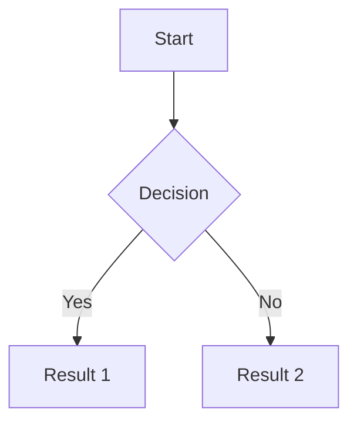
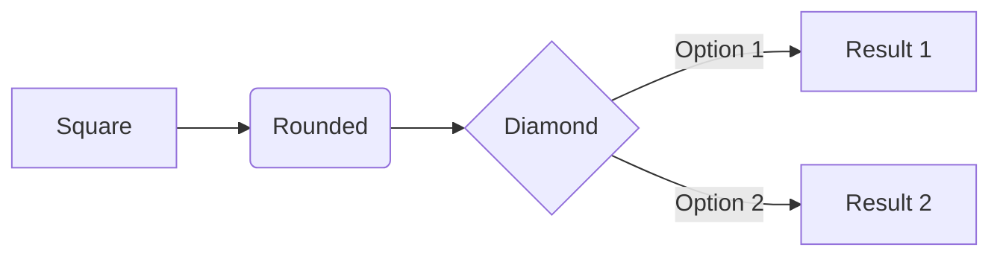
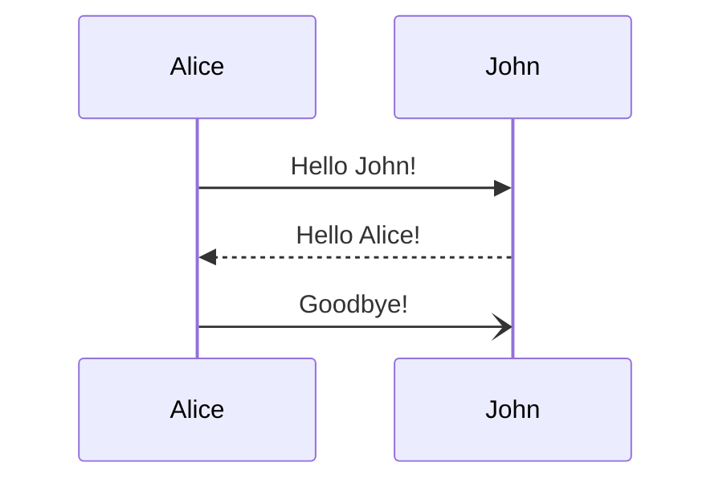
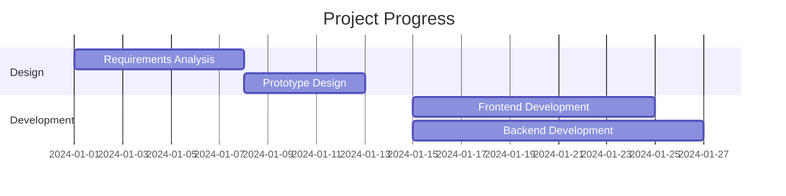
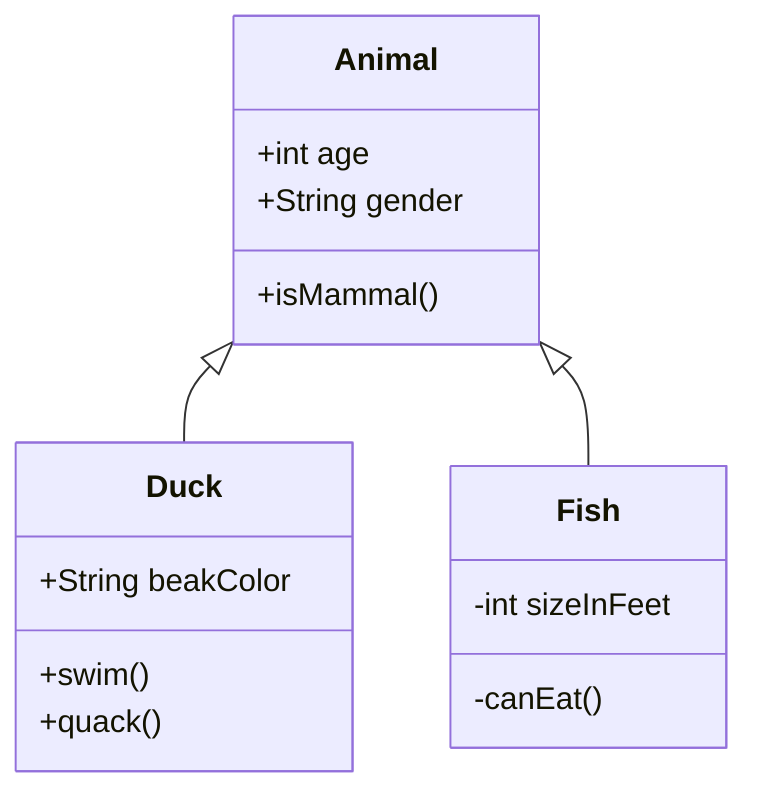

<div align="center">
    <h3>Professional Markdown + Mermaid + ECharts + KaTeX Editor</h3>
    <p>Modern · Ready-to-use · Powerful</p>
</div>
<div align="center">

</div>

**English** | [中文](README.zh-CN.md)

[Live Demo](https://steamedbread2333.github.io/MarkX)

---

## ✨ Core Features

### 📊 Mermaid Diagrams

Perfect integration with Mermaid.js for professional diagramming:

<div align="left">

- ✅ **Flowcharts** - Visualize business processes and workflows
- ✅ **Sequence Diagrams** - Show interaction sequences between components
- ✅ **Gantt Charts** - Project progress management and timeline visualization
- ✅ **Class Diagrams** - UML class relationship diagrams
- ✅ **State Diagrams** - State machine visualization
- ✅ **Export Tools** - One-click SVG/PNG export & fullscreen viewer with zoom & drag

</div>

---

### 📈 ECharts Charts

Powerful data visualization with Apache ECharts:

<div align="left">

- ✅ **Bar Charts** - Column & bar visualizations for data comparison
- ✅ **Line Charts** - Trend analysis and time series data
- ✅ **Pie Charts** - Proportional data and distribution visualization
- ✅ **Scatter Plots** - Correlation analysis and multi-dimensional data
- ✅ **Custom Charts** - Full ECharts API support for any chart type
- ✅ **JavaScript Syntax** - Code highlighting & autocomplete for better editing
- ✅ **Export Support** - SVG/PNG export & HTML/PDF export with embedded images

</div>

---

### 🧮 KaTeX Math Formulas

Powerful math formula rendering engine:

<div align="left">

- ✅ **Math Formulas** - Use `$...$` for inline and `$$...$$` for block formulas
- ✅ **Inline & Block** - Automatically detects formula type based on length
- ✅ **Rich Symbols** - Integrals, summations, matrices, and more
- ✅ **Real-time Rendering** - Display formulas as you type
- ✅ **LaTeX Syntax** - Standard mathematical typesetting
- ✅ **Quick Insert** - Built-in templates for common formulas

</div>

### 🎯 More Features

- 📝 **GFM Support** - Complete GitHub Flavored Markdown
- 🎨 **Theme Toggle** - Light/Dark eye-friendly modes
- 💾 **Auto Save** - Auto-save drafts every 30 seconds
- 📊 **Real-time Stats** - Word count, line count, reading time
- 🔒 **Security** - DOMPurify XSS protection
- 📱 **Responsive** - Perfect adaptation for desktop and mobile
- 📄 **Export PDF** - Three export modes: Default (natural truncation), Full Page (single long image), Smart Pagination (intelligent page breaks)
- 🌐 **Export HTML** - Export rendered content as standalone HTML file
- 📋 **Copy to Clipboard** - Quick copy Markdown or HTML content

## 🚀 Quick Start

### Method 1: Direct Use (Recommended)

1. **Clone the repository**
```bash
git clone https://github.com/yourusername/markx.git
cd markx
```

2. **Start a local server**

Since ES modules and Import Maps are used, access via HTTP server is required:

```bash
# Using Python (Recommended)
python3 -m http.server 8000

# Or using Node.js http-server
npx http-server -p 8000

# Or using PHP
php -S localhost:8000
```

3. **Open your browser**

Visit `http://localhost:8000` to start using!

### Method 2: Online Deployment

#### Deploy to GitHub Pages

1. Fork this repository
2. Go to repository settings → Pages
3. Select `main` branch as source
4. Wait a few minutes and access

#### Deploy to Vercel

[](https://vercel.com/new/clone?repository-url=https://github.com/yourusername/markx)

1. Click the button above
2. Log in to your Vercel account
3. One-click deployment complete

#### Deploy to Netlify

[](https://app.netlify.com/start/deploy?repository=https://github.com/yourusername/markx)

1. Click the button above
2. Log in to your Netlify account
3. Automatic deployment complete

---

## 📖 User Guide

### Basic Operations

#### Edit Markdown
Type Markdown content in the left editor, real-time preview on the right:

```markdown
# Heading 1
## Heading 2

**Bold text** *Italic text* ~~Strikethrough~~

- Unordered list item 1
- Unordered list item 2

1. Ordered list item 1
2. Ordered list item 2

[Link text](https://example.com)

```

#### 📊 Insert Mermaid Diagrams

**Method 1: Using Toolbar**
1. Click the "Diagram" button in the toolbar
2. Select the diagram type needed (Flowchart/Sequence/Gantt/Class/State)
3. Template is automatically inserted, modify content as needed

**Method 2: Manual Input**

````markdown

````

**💡 Export Feature:** Hover over any Mermaid diagram to see the export toolbar:
- **SVG Export** - Export as vector graphics (recommended, scalable)
- **PNG Export** - Export as high-resolution image (2x scale)
- **Fullscreen View** - View in fullscreen with zoom and drag support

---

#### 📈 Insert ECharts Charts

**Method: Manual Input**

Use the `echarts` code block to create interactive charts. The code supports both JSON format and JavaScript object literals:

````markdown
```echarts
{
  "title": {
    "text": "Monthly Sales",
    "left": "center"
  },
  "xAxis": {
    "type": "category",
    "data": ["Jan", "Feb", "Mar", "Apr", "May", "Jun"]
  },
  "yAxis": {
    "type": "value"
  },
  "series": [{
    "type": "bar",
    "data": [120, 200, 150, 80, 70, 110]
  }]
}
```
````

**💡 Features**:
- **JavaScript Syntax Highlighting** - ECharts blocks use JavaScript syntax highlighting for better code editing
- **JSON or JavaScript** - Supports both JSON format and JavaScript object literals
- **Full ECharts API** - Complete support for all ECharts chart types and options
- **Export Support** - Charts are automatically converted to images when exporting HTML/PDF
- **Theme Support** - Automatically adapts to light/dark theme

**Common Chart Types**:
- Bar Charts (`"type": "bar"`)
- Line Charts (`"type": "line"`)
- Pie Charts (`"type": "pie"`)
- Scatter Plots (`"type": "scatter"`)
- And many more...

---

#### 🧮 Insert Math Formulas

**Method 1: Using Toolbar**
1. Click the "Formula" button in the toolbar
2. Select formula type (Inline/Block/Fraction/Root/Sum/Integral/Limit/Matrix)
3. Template is automatically inserted, modify content as needed

**Method 2: Manual Input**

**Math Formulas** (use `$...$` for inline and `$$...$$` for block):
````markdown
Inline formula using `$...$`:

$E = mc^2$

Block formula using `$$...$$`:

$$
x = \frac{-b \pm \sqrt{b^2 - 4ac}}{2a}
$$

Multiple formulas:

$$
x = \frac{-b \pm \sqrt{b^2 - 4ac}}{2a}
$$

$E = mc^2$ is the mass-energy equivalence.

$$
\sum_{i=1}^{n} i = \frac{n(n+1)}{2}
$$

Matrix example:

$$
\begin{bmatrix}
a & b \\
c & d
\end{bmatrix}
$$
````

**💡 Important Notes**:
- Use standard LaTeX syntax:
  - `$...$` for inline formulas
  - `$$...$$` for block formulas
- Code blocks protect math syntax - `$` and `$$` inside code blocks are treated as plain text
- You can mix inline and block formulas freely in your markdown

**More Examples**:
````markdown
- Nth root:

$$
\sqrt[3]{x}
$$

- Integral:

$$
\int_{0}^{\infty} e^{-x}dx
$$

- Limit:

$$
\lim_{x \to \infty} \frac{1}{x} = 0
$$
````

---

#### Keyboard Shortcuts

| Shortcut | Function |
|----------|----------|
| `Ctrl + S` | Save file |
| `Ctrl + O` | Open file |
| `Ctrl + N` | New document |
| `Ctrl + B` | Bold |
| `Ctrl + I` | Italic |
| `Ctrl + K` | Insert link |

### Advanced Features

#### Tables
```markdown
| Column 1 | Column 2 | Column 3 |
| --- | --- | --- |
| Cell 1 | Cell 2 | Cell 3 |
| Content A | Content B | Content C |
```

#### Task Lists
```markdown
- [x] Completed task
- [ ] Pending task
- [ ] Another task
```

#### Code Blocks
````markdown
```javascript
function hello() {
    console.log('Hello, MarkX!');
}
```
````

#### 📄 Export Functions

**Export PDF** - Click the "More" button (three dots) in the toolbar, then select one of the PDF export options:

1. **Export PDF (Default)** - Natural page truncation, suitable for quick export
2. **Export PDF (Full Page)** - Export as a single long image without pagination, perfect for presentations
3. **Export PDF (Smart Pagination)** - Intelligent page breaks that avoid truncating Mermaid diagrams, code blocks, and math formulas

**Export HTML** - Export the rendered content as a standalone HTML file that can be opened in any browser.

**Copy Functions** - Quickly copy Markdown source or rendered HTML to clipboard for easy sharing.

---

## 🎨 Diagram & Chart Examples

### 📊 ECharts Examples

#### Bar Chart
````markdown
```echarts
{
  "title": { "text": "Monthly Sales", "left": "center" },
  "xAxis": { "type": "category", "data": ["Jan", "Feb", "Mar", "Apr", "May", "Jun"] },
  "yAxis": { "type": "value" },
  "series": [{ "type": "bar", "data": [120, 200, 150, 80, 70, 110] }]
}
```
````

#### Line Chart
````markdown
```echarts
{
  "title": { "text": "User Growth Trend", "left": "center" },
  "xAxis": { "type": "category", "data": ["Mon", "Tue", "Wed", "Thu", "Fri", "Sat", "Sun"] },
  "yAxis": { "type": "value" },
  "series": [{ "type": "line", "smooth": true, "data": [120, 132, 101, 134, 90, 230, 210] }]
}
```
````

#### Pie Chart
````markdown
```echarts
{
  "title": { "text": "Market Share", "left": "center" },
  "series": [{
    "type": "pie",
    "data": [
      { "value": 335, "name": "Product A" },
      { "value": 310, "name": "Product B" },
      { "value": 234, "name": "Product C" }
    ]
  }]
}
```
````

---

## 🎨 Mermaid Diagram Examples

### Flowchart
````markdown

````

### Sequence Diagram
````markdown

````

### Gantt Chart
````markdown

````

### Class Diagram
````markdown

````

---

## 🛠️ Tech Stack

### Core Libraries
- **[Marked.js](https://marked.js.org/)** `v11.1.1` - Markdown parsing
- **[Mermaid.js](https://mermaid.js.org/)** `v10.6.1` - Diagram rendering
- **[ECharts](https://echarts.apache.org/)** `v5.4.3` - Data visualization charts
- **[KaTeX](https://katex.org/)** - Math formula rendering
- **[DOMPurify](https://github.com/cure53/DOMPurify)** `v3.0.8` - XSS protection
- **[Highlight.js](https://highlightjs.org/)** `v11.9.0` - Code highlighting

### Architecture Features
- ✅ **Zero Build** - No Webpack/Vite needed, runs directly
- ✅ **ES Modules** - Native JavaScript modules
- ✅ **Import Maps** - CDN dependency management
- ✅ **Pure Static** - Deployable to any static hosting platform

### Browser Compatibility
- ✅ Chrome 90+
- ✅ Firefox 88+
- ✅ Safari 14+
- ✅ Edge 90+
- ✅ Mobile browsers (iOS Safari 14+, Chrome Mobile)

---

## 📂 Project Structure

```
markx/
├── index.html          # Main page (HTML structure)
├── src/                # Source code directory
│   ├── app.js          # Application entry point
│   ├── css/            # Stylesheets (modular CSS)
│   │   ├── styles.css  # Main stylesheet (imports all modules)
│   │   ├── variables.css
│   │   ├── base.css
│   │   ├── toolbar.css
│   │   ├── editor.css
│   │   ├── preview.css
│   │   ├── markdown.css
│   │   ├── mermaid.css
│   │   ├── katex.css
│   │   ├── components.css
│   │   ├── statusbar.css
│   │   ├── github-corner.css
│   │   ├── animations.css
│   │   └── responsive.css
│   ├── core/           # Core modules
│   ├── editor/         # Editor modules
│   ├── renderer/       # Renderer modules
│   ├── export/         # Export modules
│   ├── file/           # File operations
│   ├── ui/             # UI modules
│   └── config/         # Configuration
├── assets/             # Static assets
│   └── images/         # Images (logos, favicon)
│       ├── favicon.svg
│       ├── logo.svg
│       ├── logo-en.svg
│       ├── logo-zh.svg
│       ├── logo-dark.svg
│       ├── logo-banner.svg
│       ├── logo-banner-en.svg
│       └── logo-banner-zh.svg
├── README.md           # Project documentation (this file)
├── README.zh-CN.md     # Chinese documentation
├── LICENSE             # MIT License
└── .gitignore          # Git ignore file
```

---

<div align="center">


<br><br>

**If MarkX is helpful, please give it a ⭐️ Star!**

</div>
