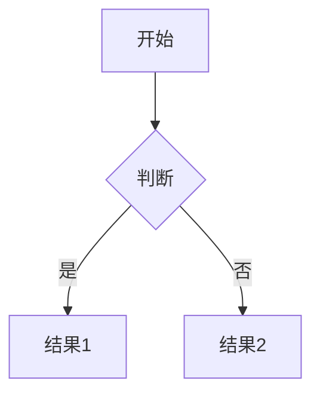
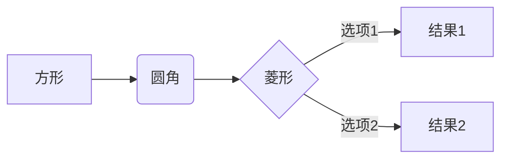
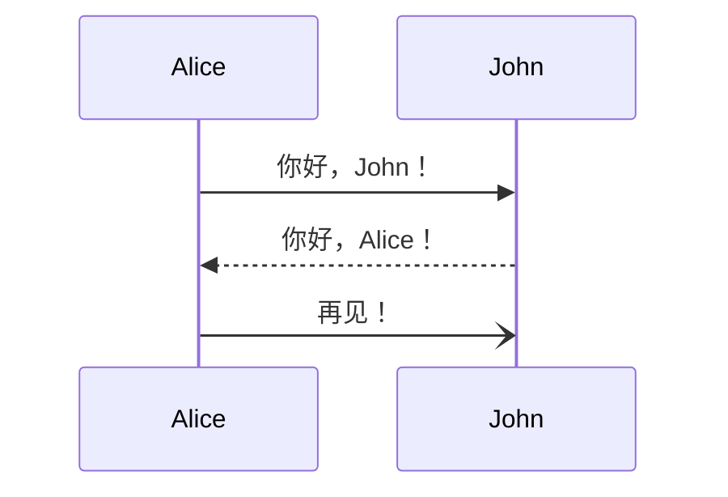
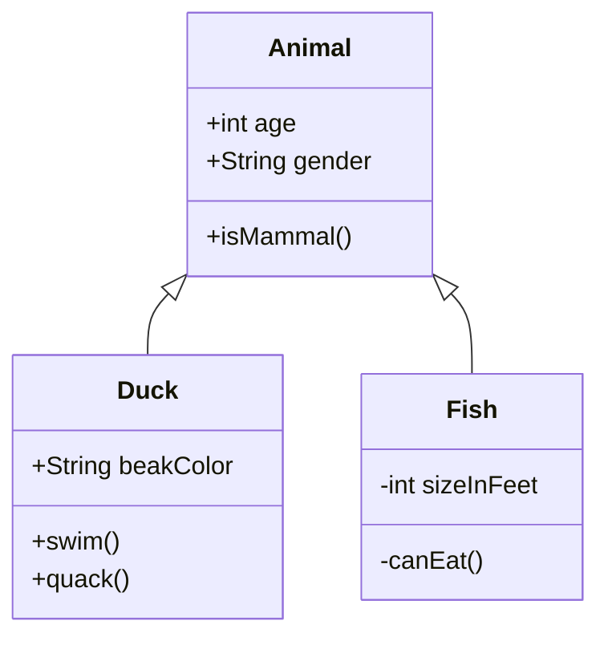

<div align="center">
    <h3>专业的 Markdown + Mermaid + KaTeX 编辑器</h3>
    <p>现代化 · 开箱即用 · 功能强大</p>
</div>
<div align="center">

</div>

[在线演示](https://steamedbread2333.github.io/MarkX)

---

## ✨ 核心特性

<table>
<tr>
<td width="50%">

### 📊 Mermaid 图表支持

完美集成 Mermaid.js，支持多种专业图表：

- ✅ **流程图** - 可视化业务流程
- ✅ **时序图** - 展示交互时序
- ✅ **甘特图** - 项目进度管理
- ✅ **类图** - UML 类关系图
- ✅ **状态图** - 状态机可视化
- ✅ **一键导出** - 支持 SVG/PNG 格式

</td>
<td width="50%">

### 🧮 KaTeX 数学公式

强大的数学公式渲染引擎：

- ✅ **行内公式** - `$E=mc^2$` 
- ✅ **块级公式** - `$$\int_0^\infty$$`
- ✅ **丰富符号** - 积分、求和、矩阵等
- ✅ **实时渲染** - 输入即显示
- ✅ **LaTeX 语法** - 标准数学排版
- ✅ **快速插入** - 内置常用模板

</td>
</tr>
</table>

### 🎯 更多功能

- 📝 **GFM 支持** - 完整的 GitHub Flavored Markdown
- 🎨 **主题切换** - 亮色/暗色护眼模式
- 💾 **自动保存** - 每 30 秒自动保存草稿
- 📊 **实时统计** - 字数、行数、阅读时间
- 🔒 **安全防护** - DOMPurify XSS 防护
- 📱 **响应式** - 完美适配桌面和移动端

## 🚀 快速开始

### 方法一：直接使用（推荐）

1. **克隆仓库**
```bash
git clone https://github.com/yourusername/markx.git
cd markx
```

2. **启动本地服务器**

由于使用了 ES 模块和 Import Maps，需要通过 HTTP 服务器访问：

```bash
# 使用 Python (推荐)
python3 -m http.server 8000

# 或使用 Node.js http-server
npx http-server -p 8000

# 或使用 PHP
php -S localhost:8000
```

3. **打开浏览器**

访问 `http://localhost:8000` 即可使用！

### 方法二：在线部署

#### 部署到 GitHub Pages

1. Fork 本仓库
2. 进入仓库设置 → Pages
3. Source 选择 `main` 分支
4. 保存后等待几分钟即可访问

#### 部署到 Vercel

[](https://vercel.com/new/clone?repository-url=https://github.com/yourusername/markx)

1. 点击上方按钮
2. 登录 Vercel 账号
3. 一键部署完成

#### 部署到 Netlify

[](https://app.netlify.com/start/deploy?repository=https://github.com/yourusername/markx)

1. 点击上方按钮
2. 登录 Netlify 账号
3. 自动部署完成

---

## 📖 使用指南

### 基础操作

#### 编辑 Markdown
在左侧编辑器输入 Markdown 内容，右侧实时预览：

```markdown
# 一级标题
## 二级标题

**加粗文本** *斜体文本* ~~删除线~~

- 无序列表项 1
- 无序列表项 2

1. 有序列表项 1
2. 有序列表项 2

[链接文本](https://example.com)

```

#### 📊 插入 Mermaid 图表

**方法一：使用工具栏**
1. 点击工具栏的「图表」按钮
2. 选择需要的图表类型（流程图/时序图/甘特图/类图/状态图）
3. 自动插入模板，修改内容即可

**方法二：手动输入**

````markdown

````

**💡 提示：** 每个 Mermaid 图表都支持导出为 SVG 或 PNG 格式！

---

#### 🧮 插入数学公式

**方法一：使用工具栏**
1. 点击工具栏的「公式」按钮
2. 选择公式类型（行内/块级/分数/根号/求和/积分/极限/矩阵）
3. 自动插入模板，修改内容即可

**方法二：手动输入**

**行内公式**（使用单个 `$` 包裹）：
```markdown
质能方程：$E = mc^2$，勾股定理：$a^2 + b^2 = c^2$
```

**块级公式**（使用双 `$$` 包裹，独立成行）：
```markdown
二次方程求根公式：

$$
x = \frac{-b \pm \sqrt{b^2 - 4ac}}{2a}
$$

矩阵示例：

$$
\begin{bmatrix}
a & b \\
c & d
\end{bmatrix}
$$
```

**💡 重要提示**：
- 块级公式的 `$$` 符号必须单独占一行
- 公式内容可以跨越多行
- 前后要有空行以确保正确渲染

**常用示例**：
```markdown
- 分数：$\frac{a}{b}$
- 根号：$\sqrt{x}$ 或 $\sqrt[3]{x}$
- 求和：$\sum_{i=1}^{n} i$
- 积分：$\int_{0}^{\infty} e^{-x}dx$
- 极限：$\lim_{x \to \infty} \frac{1}{x} = 0$
```

---

#### 快捷键

| 快捷键 | 功能 |
|--------|------|
| `Ctrl + S` | 保存文件 |
| `Ctrl + O` | 打开文件 |
| `Ctrl + N` | 新建文档 |
| `Ctrl + B` | 加粗 |
| `Ctrl + I` | 斜体 |
| `Ctrl + K` | 插入链接 |

### 高级功能

#### 表格
```markdown
| 列1 | 列2 | 列3 |
| --- | --- | --- |
| 单元格1 | 单元格2 | 单元格3 |
| 内容A | 内容B | 内容C |
```

#### 任务列表
```markdown
- [x] 已完成任务
- [ ] 待完成任务
- [ ] 另一个任务
```

#### 代码块
````markdown
```javascript
function hello() {
    console.log('Hello, MarkX!');
}
```
````

---

## 🎨 Mermaid 图表示例

### 流程图
````markdown

````

### 时序图
````markdown

````

### 甘特图
````markdown

````

### 类图
````markdown

````

---

## 🛠️ 技术栈

### 核心库
- **[Marked.js](https://marked.js.org/)** `v11.1.1` - Markdown 解析
- **[Mermaid.js](https://mermaid.js.org/)** `v10.6.1` - 图表渲染
- **[DOMPurify](https://github.com/cure53/DOMPurify)** `v3.0.8` - XSS 防护
- **[Highlight.js](https://highlightjs.org/)** `v11.9.0` - 代码高亮

### 架构特点
- ✅ **零构建** - 无需 Webpack/Vite，直接运行
- ✅ **ES Modules** - 原生 JavaScript 模块
- ✅ **Import Maps** - CDN 依赖管理
- ✅ **纯静态** - 可部署到任何静态托管平台

### 浏览器兼容性
- ✅ Chrome 90+
- ✅ Firefox 88+
- ✅ Safari 14+
- ✅ Edge 90+
- ✅ 移动端浏览器（iOS Safari 14+, Chrome Mobile）

---

## 📂 项目结构

```
markx/
├── index.html          # 主页面（HTML 结构）
├── styles.css          # 样式文件（CSS + 主题）
├── app.js              # 应用逻辑（JavaScript）
├── README.md           # 项目文档（本文件）
├── LICENSE             # MIT 许可证
├── .gitignore          # Git 忽略文件
└── screenshots/        # 截图目录
    ├── light-mode.png
    ├── dark-mode.png
    └── mobile.png
```

---

<div align="center">


<br><br>

**如果觉得 MarkX 有帮助，请给个 ⭐️ Star 支持一下！**

</div>

