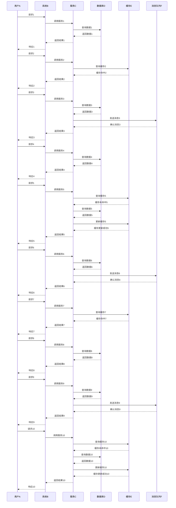
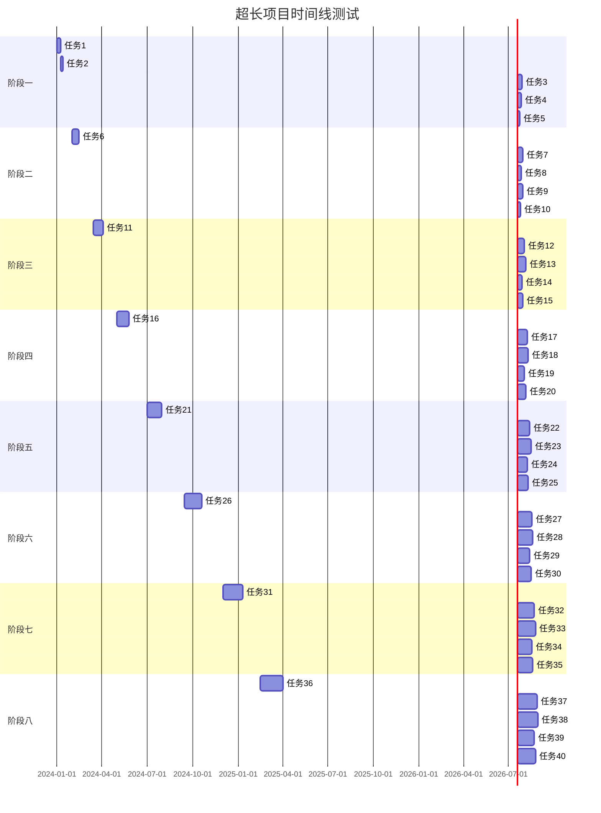

# 超长 Mermaid 图表测试文档

这是一个用于测试 PDF 导出功能的测试文档，包含超长的 Mermaid 图表。

## 测试说明

本文档包含多个超长的 Mermaid 图表，用于测试：
- SVG 超过一页高度时的截断功能
- 分页逻辑是否正确处理超长 SVG
- 文字元素不会被截断

## 超长流程图测试

```mermaid
graph TD
    A[开始] --> B[步骤1]
    B --> C[步骤2]
    C --> D[步骤3]
    D --> E[步骤4]
    E --> F[步骤5]
    F --> G[步骤6]
    G --> H[步骤7]
    H --> I[步骤8]
    I --> J[步骤9]
    J --> K[步骤10]
    K --> L[步骤11]
    L --> M[步骤12]
    M --> N[步骤13]
    N --> O[步骤14]
    O --> P[步骤15]
    P --> Q[步骤16]
    Q --> R[步骤17]
    R --> S[步骤18]
    S --> T[步骤19]
    T --> U[步骤20]
    U --> V[步骤21]
    V --> W[步骤22]
    W --> X[步骤23]
    X --> Y[步骤24]
    Y --> Z[步骤25]
    Z --> AA[步骤26]
    AA --> AB[步骤27]
    AB --> AC[步骤28]
    AC --> AD[步骤29]
    AD --> AE[步骤30]
    AE --> AF[步骤31]
    AF --> AG[步骤32]
    AG --> AH[步骤33]
    AH --> AI[步骤34]
    AI --> AJ[步骤35]
    AJ --> AK[步骤36]
    AK --> AL[步骤37]
    AL --> AM[步骤38]
    AM --> AN[步骤39]
    AN --> AO[步骤40]
    AO --> AP[步骤41]
    AP --> AQ[步骤42]
    AQ --> AR[步骤43]
    AR --> AS[步骤44]
    AS --> AT[步骤45]
    AT --> AU[步骤46]
    AU --> AV[步骤47]
    AV --> AW[步骤48]
    AW --> AX[步骤49]
    AX --> AY[步骤50]
    AY --> AZ[结束]
```

## 超长时序图测试

## 超长甘特图测试

## 超长状态图测试

```mermaid
stateDiagram-v2
    [*] --> 状态1
    状态1 --> 状态2: 事件1
    状态2 --> 状态3: 事件2
    状态3 --> 状态4: 事件3
    状态4 --> 状态5: 事件4
    状态5 --> 状态6: 事件5
    状态6 --> 状态7: 事件6
    状态7 --> 状态8: 事件7
    状态8 --> 状态9: 事件8
    状态9 --> 状态10: 事件9
    状态10 --> 状态11: 事件10
    状态11 --> 状态12: 事件11
    状态12 --> 状态13: 事件12
    状态13 --> 状态14: 事件13
    状态14 --> 状态15: 事件14
    状态15 --> 状态16: 事件15
    状态16 --> 状态17: 事件16
    状态17 --> 状态18: 事件17
    状态18 --> 状态19: 事件18
    状态19 --> 状态20: 事件19
    状态20 --> 状态21: 事件20
    状态21 --> 状态22: 事件21
    状态22 --> 状态23: 事件22
    状态23 --> 状态24: 事件23
    状态24 --> 状态25: 事件24
    状态25 --> 状态26: 事件25
    状态26 --> 状态27: 事件26
    状态27 --> 状态28: 事件27
    状态28 --> 状态29: 事件28
    状态29 --> 状态30: 事件29
    状态30 --> 状态31: 事件30
    状态31 --> 状态32: 事件31
    状态32 --> 状态33: 事件32
    状态33 --> 状态34: 事件33
    状态34 --> 状态35: 事件34
    状态35 --> 状态36: 事件35
    状态36 --> 状态37: 事件36
    状态37 --> 状态38: 事件37
    状态38 --> 状态39: 事件38
    状态39 --> 状态40: 事件39
    状态40 --> [*]: 完成
```

## 超长类图测试

```mermaid
classDiagram
    class Class1 {
        +String field1
        +int field2
        +method1()
        +method2()
    }
    class Class2 {
        +String field3
        +int field4
        +method3()
        +method4()
    }
    class Class3 {
        +String field5
        +int field6
        +method5()
        +method6()
    }
    class Class4 {
        +String field7
        +int field8
        +method7()
        +method8()
    }
    class Class5 {
        +String field9
        +int field10
        +method9()
        +method10()
    }
    class Class6 {
        +String field11
        +int field12
        +method11()
        +method12()
    }
    class Class7 {
        +String field13
        +int field14
        +method13()
        +method14()
    }
    class Class8 {
        +String field15
        +int field16
        +method15()
        +method16()
    }
    class Class9 {
        +String field17
        +int field18
        +method17()
        +method18()
    }
    class Class10 {
        +String field19
        +int field20
        +method19()
        +method20()
    }
    class Class11 {
        +String field21
        +int field22
        +method21()
        +method22()
    }
    class Class12 {
        +String field23
        +int field24
        +method23()
        +method24()
    }
    class Class13 {
        +String field25
        +int field26
        +method25()
        +method26()
    }
    class Class14 {
        +String field27
        +int field28
        +method27()
        +method28()
    }
    class Class15 {
        +String field29
        +int field30
        +method29()
        +method30()
    }
    class Class16 {
        +String field31
        +int field32
        +method31()
        +method32()
    }
    class Class17 {
        +String field33
        +int field34
        +method33()
        +method34()
    }
    class Class18 {
        +String field35
        +int field36
        +method35()
        +method36()
    }
    class Class19 {
        +String field37
        +int field38
        +method37()
        +method38()
    }
    class Class20 {
        +String field39
        +int field40
        +method39()
        +method40()
    }
    
    Class1 <|-- Class2
    Class2 <|-- Class3
    Class3 <|-- Class4
    Class4 <|-- Class5
    Class5 <|-- Class6
    Class6 <|-- Class7
    Class7 <|-- Class8
    Class8 <|-- Class9
    Class9 <|-- Class10
    Class10 <|-- Class11
    Class11 <|-- Class12
    Class12 <|-- Class13
    Class13 <|-- Class14
    Class14 <|-- Class15
    Class15 <|-- Class16
    Class16 <|-- Class17
    Class17 <|-- Class18
    Class18 <|-- Class19
    Class19 <|-- Class20
```

## 测试内容说明

本文档包含以下超长 Mermaid 图表：

1. **超长流程图**：包含 50 个节点的流程图，测试垂直方向的超长图表
2. **超长时序图**：包含 10 个交互序列的时序图，测试水平方向的超长图表
3. **超长甘特图**：包含 40 个任务的甘特图，测试时间轴的超长图表
4. **超长状态图**：包含 40 个状态的状态图，测试状态转换的超长图表
5. **超长类图**：包含 20 个类的类图，测试类关系的超长图表

这些图表都设计为超过一页 A4 纸的高度，用于测试 PDF 导出时的分页和截断功能。

## 测试要点

- ✅ SVG 超过一页高度时应该被截断
- ✅ 文字元素（如标题、段落）不应该被截断
- ✅ 分页应该在合适的位置进行
- ✅ 每个图表应该能够正确显示在 PDF 中
